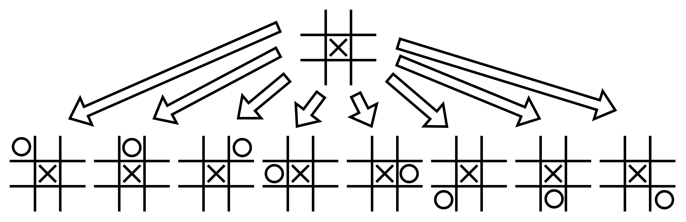

# Game Optimization Project

Authored By: Simon Lidwell

--------------

*Table of Contents*

* [Introduction](#introduction)
    * [How to Run This Project](#how-to-run-this-project)
* [Game Optimization Theory](#game-optimization-theory)
* [Project Deliverables](#project-deliverables)
* [Limitations](#limitations)
* [Future Work](#future-work)
* [Conclusion](#conclusion)

## Introduction

I hope this project finds you well, Professor Isken (I had to add that in there because I saw your announcement about
unintended consequences of GenAI in tech hiring).

I had a ton of fun putting this together; it has truly been a while since I've worked on some kind of programming
passion project. So I tried my best to put together something respectable. The idea behind this comes from the engineer
within me that needs to know how things are made. Well, in this case, how to win games.

I added in a bit of *personal flare* to this project to try and challenge myself programmatically rather than turn
in the most basic thing you have ever gotten.

Realistically, this project went from "data analytics" to me to more of
something I'd want to put on my personal GitHub page.
At my job, I'm familiar with taking data from one place and moving it to another place.
Really ETL is all I do all day
all the time.
Which is great because I like solving business problems, but I rarely organically build something from the
ground up that challenges me.
I had lofty expectations of myself when I started this project but very quickly realized I am not as good as I thought I
was.
I think that this project is something that I will want to continue building out into other algorithms and other
languages, as you'll see, Python is exactly a speedster (a lot of the performance bottlenecks is the million prints I'm
doing, but oh well)

### How to Run This Project

There are two ways you can get this project up and running:

1. **Using the `uv` package manager**

   If you are planning on using `uv`, here is the best way to do that in my opinion:

    ```bash
    uv install
    # if you don't have uv installed then:
    #   pip install pipx
    #   pipx install uv
    #   uv install
    uv run python -m src.main
    ```

I've run into issues in industry where sharing python environments between people is incredibly difficult when just
managing a `requirements.txt` with `pip freeze > requirements.txt`, so I have never used the pyproject.toml format and
uv seems a lot better than poetry in my opinion. I did test out both for this project and uv is snappy fast and I also
thought it was easier to implement, so that is why I chose it for this project.

2. **Using the `pip` package manager**

   If you prefer to use `pip`, follow these steps (I used Python 3.13):

    ```bash
    python -m venv .venv
    .venv\Scripts\activate

    pip install -r requirements.txt
    python -m src.main
    ```

This is the *traditional* method, it works, but I like locking down the version of python used as well, which the
`requirements.txt` does not capture, so you have to put it in a `README.md` somewhere and it usually is not enforceable.

#### Where the main project focus lives

After getting the backend spun up, you should be able to walk
through [game_optimization_project.ipynb](game_optimization_project.ipynb).

## Game Optimization Theory

### What is Minimax?

The Minimax algorithm is a decision-making algorithm commonly used in two-player, turn-based games like Tic Tac Toe,
Chess, and Checkers. It simulates all possible moves in the game, evaluates the potential outcomes, and chooses the move
that maximizes the AI's chances of winning while minimizing the opponent's chances.

### How it works

* The algorithm recursively explores all possible game states resulting from each move.
    * Constructs game tree
        * Nodes represent game states
        * Edges represent moves
        * Terminal nodes represent end-game states, each with an associated utility value (win, loss, or tie)



```python
if result == self.human_player:
    return -1  # loss
elif result == self.ai_player:
    return 1  # win
elif result == 'Tie':
    return 0  # tie
```

* It alternates between maximizing and minimizing at each level of recursion.
    * One player tries to maximize their score
    * The opponent tries to minimize the score of the maximizer
* Optimal decision
    * The root of the tree provides the best possible move for the current player

### Advantages of Minimax

* **Optimal Play:** Ensures the AI plays optimally, never losing if a win or tie is possible.
* **Simplicity:** Straightforward to implement for simple games like Tic Tac Toe.

## Project Deliverables

**Gameplay**

I created a backend using FastAPI, SQLAlchemy ORM, and SQLite.

Starting with the very backend, SQLite, Python ships with SQLite! So you should be able to import all of my data as it
is located in the root of this project folder. It is super useful and on its website, SQLite boasts, "SQLite is the most
used database engine in the world". I had never used it before, so I wanted to become a little more familiar with what
it is/does. Really, the main take away is that since Python ships with SQLite, its incredibly effective for persisting
data into remote repositories for sharing across computers. I wouldn't recommend huge datasets, but realistically a
couple mb's of data never hurt anybody.

```sql
SELECT games.id,
       games.createdat,
       games.winner,
       games.game_type,
       moves.id AS move_id,
       moves.player,
       moves.row,
       moves.col,
       moves.timestamp
FROM games
         INNER JOIN moves ON games.id = moves.game_id
WHERE games.winner IS NOT NULL
```

Then I created the database using the SQLAlchemy ORM. Why you may ask? I never get the opportunity to really do this,
I've seldom had any experience with object relational
mappers and wanted to try out how SQLAlchemy does it. So I chose the most widely deployed Python ORM and the most used
database engine for this project.

```python
class Game(Base):
    __tablename__ = 'games'

    id = Column(String(36), primary_key=True, default=lambda: str(uuid4()), unique=True, nullable=False)
    createdat = Column(DateTime, default=datetime.now(UTC), nullable=False)
    winner = Column(Enum('X', 'O', 'Tie', name='game_winner'), nullable=True)
    game_type = Column(Enum('TicTacToe', 'Connect4', name='game_type'), nullable=False)

    moves = relationship('Move', back_populates='game', cascade='all, delete-orphan')
```

As well as, I wrapped this in a simple api to communicate with the backend.
I mainly did this to store game state, game data, and move data.
Storing
this data in a db allows me to replay the games later for data analysis.
I think that every data analyst should be familiar with web data, being able to get and manipulate web data
is a quintessential skill of data analytics. Like I've increasingly had to deal with data that is the end product of
REST and depending on how nested the JSON structure is, doing some data analysis on web data can get gnarly pretty
fast.

```python
@router.post(
    "/games/{game_type}",
    response_model=GameRead,
    status_code=status.HTTP_201_CREATED,
)
def create_game(game_type: str, db: Session = Depends(get_db)):
    db_game = Game(game_type=game_type)
    db.add(db_game)
    db.commit()
    db.refresh(db_game)
    return db_game
```

## Limitations

* **Computationally Intensive:** Not suitable for games with large state spaces without optimizations like Alpha-Beta
  pruning.
* **Assumes Optimal Opponent:** The AI assumes the opponent plays optimally, which may not always be the case in
  real-world scenarios.
* **Knowledge Base:** Understanding how applications like Stockfish work through maximizing chess bots gameplay is
  fascinating. This just scratches the surface of the complexities of chess.

## Future Work

* Alpha-Beta Pruning
    * Enhances the minimax algorithm by skipping branches that don't affect the final decision
    * Reduces the number of nodes evaluated, making minimax computationally possible for larger trees
* Reinforcement Learning Algorithms
    * These algorithms can learn strategies for adversarial games without explicit modeling of the opponent
        * One of the best videos I've ever seen about reinforcement learning in general was this AI that learned how to
          [play Pokémon through reinforcement learning](https://www.youtube.com/watch?v=DcYLT37ImBY),
          it was basically a
          convolutional neural network that took images
          of the game state and decided what to do with the player based on a reward system
* I would like to rewrite some of the game play for Connect 4 in something like Rust, I've been keying in on some fun
  projects to implement in Rust, and I had a lot of fun putting this together
